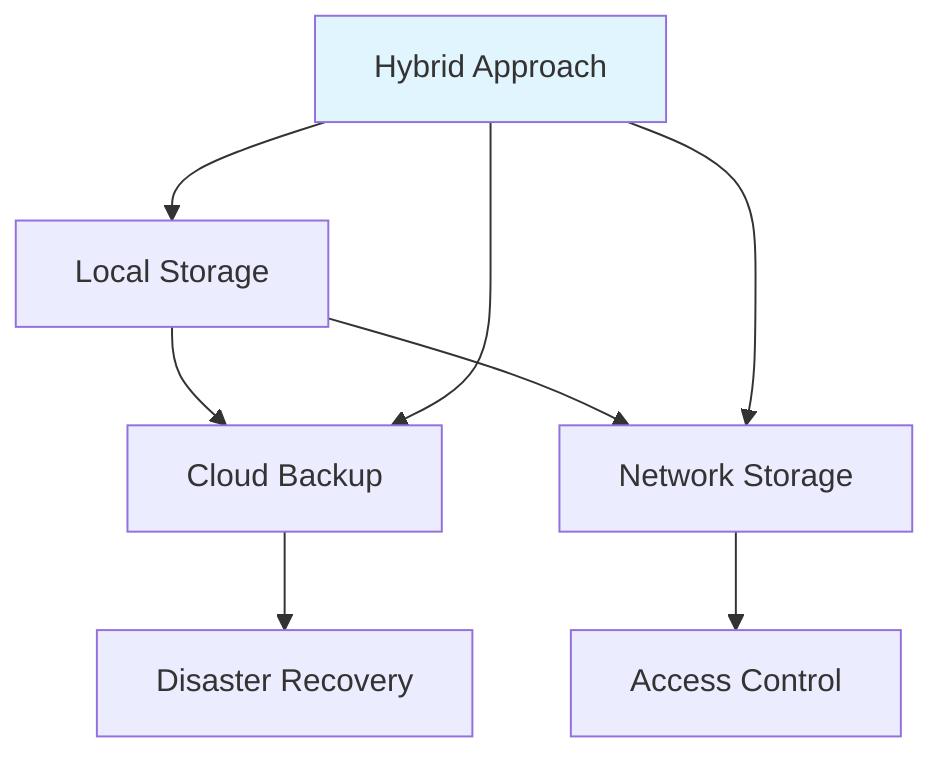
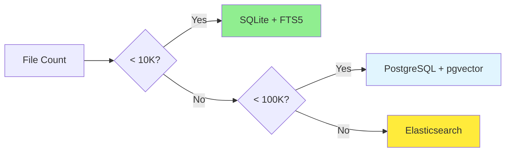
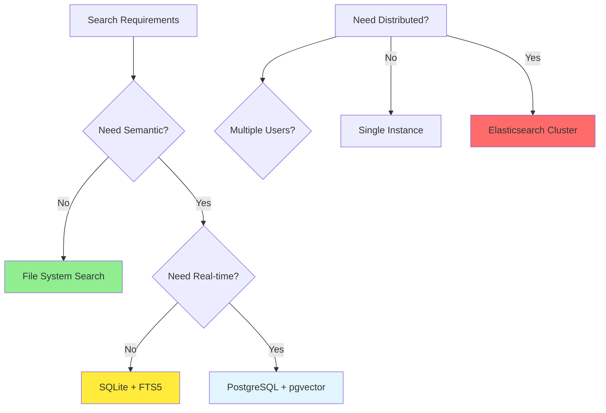

# Organization Decision Matrix - Choose Your Approach

## 🎯 Quick Assessment

### **Scale Evaluation**
| File Count | Recommended Approach | Complexity | Setup Time |
|------------|-------------------|------------|-------------|
| <1K | Basic Manual | Low | 1-2 hours |
| 1K-10K | Structured Manual | Medium | 4-6 hours |
| 10K-50K | Automated System | High | 1-2 days |
| 50K+ | Enterprise System | Very High | 3-5 days |

### **Use Case Analysis**
| Primary Need | Best System | Key Features |
|-------------|------------|-------------|
| Personal Photos | Chronological + Event | Auto-tagging, face recognition |
| Development Projects | Functional + Language | Code search, dependency tracking |
| Team Collaboration | Role-Based Access | Permissions, version control |
| Research Data | Topic + Metadata | Full-text search, citations |
| Business Records | Compliance + Audit | Retention policies, encryption |

## 🏗️ System Architecture Decisions

### **Storage Strategy**


#### **Local Storage Options**
| Option | Pros | Cons | Best For |
|--------|------|------|----------|
| File System | Fast, no cost | No sync, single device | Personal use |
| NAS Device | Network access, backup | Hardware cost, maintenance | Small teams |
| RAID Array | Redundancy, performance | Complex setup | Critical data |

#### **Cloud Storage Options**
| Provider | Features | Cost | Privacy |
|---------|---------|------|---------|
| Nextcloud | Self-hosted, encryption | Hardware/maintenance | High |
| Dropbox | Simple, fast sync | Limited control | Medium |
| Google Drive | Search, integration | Data mining | Low |
| OneDrive | Windows integration | Microsoft ecosystem | Medium |

### **Database Selection**


| Scale | Recommended DB | Setup Complexity | Search Features |
|-------|---------------|----------------|----------------|
| Personal (<1K) | File System | None | Filename/path only |
| Small Team (1K-10K) | SQLite + FTS5 | Low | Full-text search |
| Medium Team (10K-50K) | PostgreSQL + pgvector | Medium | Semantic + metadata |
| Enterprise (50K+) | Elasticsearch + Vector | High | Advanced semantic |

## 🎨 Category System Design

### **Industry-Specific Adaptations**

#### **Software Development**
```
📁 development/
├── 📁 active_projects/          # Current sprints
├── 📁 libraries_frameworks/       # Reusable components
├── 📁 tools_utilities/          # Development tools
├── 📁 documentation/            # API docs, guides
├── 📁 testing/                  # Test suites, E2E
├── 📁 deployment/               # CI/CD, production
└── 📁 archived_projects/         # Completed work
```

#### **Creative/Media**
```
📁 creative/
├── 📁 projects_by_client/       # Client work
├── 📁 assets_templates/        # Reusable assets
├── 📁 source_files/            # Raw materials
├── 📁 drafts_work_in_progress/  # Active creation
├── 📁 final_deliverables/      # Completed work
├── 📁 references_inspiration/  # Research, mood boards
└── 📁 archived_work/           # Old versions
```

#### **Research/Academic**
```
📁 research/
├── 📁 literature_review/        # Papers, articles
├── 📁 data_sets/               # Research data
├── 📁 experiments/             # Lab work, results
├── 📁 writing_projects/         # Papers, publications
├── 📁 presentations/           # Conference talks
├── 📁 collaboration/           # Shared projects
└── 📁 references/              # Citations, sources
```

#### **Business/Finance**
```
📁 business/
├── 📁 financial_records/        # Transactions, reports
├── 📁 legal_compliance/        # Contracts, policies
├── 📁 project_management/       # Plans, timelines
├── 📁 marketing_materials/     # Campaigns, brochures
├── 📁 client_communications/   # Emails, notes
├── 📁 hr_documents/           # Employee files
└── 📁 archived_business/       # Historical records
```

### **Personalization Framework**
```python
# Custom category generator
def generate_categories(user_profile):
    """Generate personalized category system"""
    
    base_categories = STANDARD_CATEGORIES
    
    # Customize based on user role
    if user_profile['role'] == 'developer':
        base_categories.update({
            'api_projects': 'API Development & Integration',
            'libraries': 'Reusable Components & Frameworks',
            'testing': 'Quality Assurance & Testing'
        })
    
    elif user_profile['role'] == 'designer':
        base_categories.update({
            'client_work': 'Client Projects & Deliverables',
            'creative_assets': 'Templates & Reusable Elements',
            'inspiration': 'References & Mood Boards'
        })
    
    # Customize based on scale
    if user_profile['file_count'] > 50000:
        base_categories.update({
            'archive': 'Long-term Storage & Backup',
            'compliance': 'Legal & Regulatory Requirements'
        })
    
    return base_categories
```

## 🔧 Technology Stack Decisions

### **Search Technology**


### **Automation Level**
| Automation | Tools Required | Maintenance | Best For |
|-----------|---------------|------------|-----------|
| Manual | File manager only | High | <100 files |
| Semi-Auto | Scripts + scheduler | Medium | 1K-10K files |
| Full-Auto | Vector DB + AI | Low | 10K+ files |

### **Platform Selection**
| Platform | Pros | Cons | Deployment |
|---------|------|------|------------|
| Desktop App | Rich UI, offline access | Platform-specific | Windows/macOS/Linux |
| Web App | Cross-platform, sharing | Requires server | Browser-based |
| CLI Tool | Scriptable, fast | Learning curve | Developers, sysadmins |
| Mobile App | Anywhere access | Small screen | Quick access, review |

## 📋 Implementation Templates

### **Quick Start Templates**

#### **Personal Organization**
```bash
#!/bin/bash
# personal_org.sh - Quick personal setup

CATEGORIES=(
    "documents"
    "pictures" 
    "downloads"
    "projects"
    "archives"
)

for category in "${CATEGORIES[@]}"; do
    mkdir -p "$HOME/organized/$category"
done

echo "✅ Personal organization structure created"
echo "📁 Categories: ${CATEGORIES[*]}"
```

#### **Team Organization**
```bash
#!/bin/bash
# team_org.sh - Team collaboration setup

TEAM_MEMBERS=("alice" "bob" "charlie")
SHARED_CATEGORIES=("shared" "projects" "resources" "templates")

# Create shared structure
for category in "${SHARED_CATEGORIES[@]}"; do
    mkdir -p "team_shared/$category"
done

# Create personal spaces
for member in "${TEAM_MEMBERS[@]}"; do
    mkdir -p "team_members/$member"
    mkdir -p "team_members/$member/{projects,notes,resources}"
done

# Set permissions
chmod -R g+w team_shared/
chown -R :teamusers team_shared/
```

#### **Development Project**
```bash
#!/bin/bash
# dev_project.sh - Development project setup

PROJECT_NAME=$1
if [ -z "$PROJECT_NAME" ]; then
    echo "Usage: $0 <project_name>"
    exit 1
fi

mkdir -p "development/$PROJECT_NAME/{src,tests,docs,config,scripts,deploy}"

# Create git repo
cd "development/$PROJECT_NAME"
git init
echo "node_modules/" > .gitignore
echo ".env" >> .gitignore
echo "dist/" >> .gitignore

# Create README
cat > README.md << EOF
# $PROJECT_NAME

## Description
Project description here...

## Development
\`\`\`bash
npm install
npm run dev
\`\`\`

## Structure
- \`src/\` - Source code
- \`tests/\` - Test suites
- \`docs/\` - Documentation
- \`config/\` - Configuration files
EOF

echo "✅ Development project '$PROJECT_NAME' created"
```

## 🎯 Decision Checklist

### **Initial Assessment**
- [ ] **File Count**: Estimate total files to organize
- [ ] **Growth Rate**: How many new files per month
- [ ] **Access Patterns**: Frequently vs. rarely accessed files
- [ ] **Collaboration**: Personal vs. team vs. enterprise
- [ ] **Technical Comfort**: CLI vs. GUI vs. web interface
- [ ] **Privacy Requirements**: Local vs. cloud vs. hybrid
- [ ] **Budget**: Free vs. paid solutions
- [ ] **Maintenance**: Time available for upkeep

### **Technology Selection**
- [ ] **Storage**: Local SSD, NAS, cloud storage
- [ ] **Database**: SQLite, PostgreSQL, Elasticsearch
- [ ] **Search**: Basic, full-text, semantic
- [ ] **Interface**: Desktop, web, mobile, CLI
- [ ] **Automation**: Manual, scripts, AI-powered
- [ ] **Backup Strategy**: Local, cloud, hybrid
- [ ] **Security**: Encryption, access control, audit

### **Implementation Planning**
- [ ] **Migration Strategy**: How to move existing files
- [ ] **Downtime**: Acceptable organization window
- [ ] **Rollback Plan**: How to undo changes
- [ ] **Testing**: Validation approach for new system
- [ ] **Training**: Learning curve for new tools
- [ ] **Documentation**: Knowledge capture for team

### **Success Criteria**
- [ ] **Find Time**: <10 seconds for any file
- [ ] **Organization Rate**: >95% files properly categorized
- [ ] **Maintenance**: <1 hour per month upkeep
- [ ] **User Satisfaction**: Intuitive, minimal frustration
- [ ] **Scalability**: Handles 2x current growth
- [ ] **Backup Recovery**: <1 hour restore time

---

## 🎊 Decision Framework Status

**Version**: 1.0  
**Last Updated**: November 19, 2025  
**Coverage**: Personal to Enterprise scales  
**Implementation**: 1-5 days depending on complexity  

*Use this matrix to select the optimal organization approach for your specific needs and scale.*